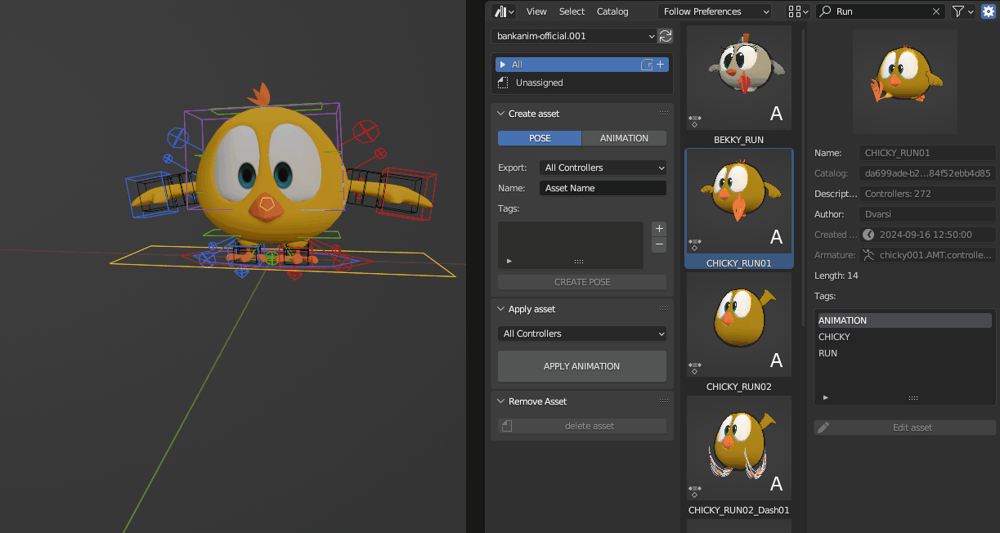

# Animation library

Animation Library: a Blender add-on to enhance Animation / Pose asset's workflow within the Asset Browser.

## Features

- Non-local pose & animation asset creation/edition/deletion
- Animation preview
- Automatic asset taging
- Partial Pose & Animation loading

## Limitations

- As of now, only compatible with blender 3.6 LTS (4.x support is a WIP)
- Only compatible with actions datablocks

## Installation

1. Download a .zip of the repository 
2. Start blender 
3. Open add-ons preferences
4. Click install button and select the downloaded .zip file 
5. Activate the add-on

## How to use


### Library setup

The library setup will define **where** assets are published during their creation and optionnaly **who** can create/edit those assets.

1. Create a library or add an existing one ([Blender manual guide](https://docs.blender.org/manual/en/3.6/files/asset_libraries/introduction.html#what-is-an-asset-library))
2. In the library folder root, add a `users_rights.json` if you want to limit asset edition/creation rights. By default, any user can apply any assets and edit its **own** assets. `super_users` can **modify/delete** any assets.`creators` can **only create** assets. A sample file: 

    ```json
    {
    "super_users": [
        "username1",
        "username2"
    ],
    "creators" : [
        "username3",
    ]
    }

    ```

### Interface overview

The animation library bring additionnal interface elements in the **Asset Browser** area. Those changes are located in the Tool panel and the Side panel.


In the Tool panel(left on the capture) you will find an:
- Asset creation tool 
- Asset application tool
- Asset removing tool

In the Side panel(right on the capture), you will find:
- Active asset metadata 
- Active asset editing tool

### Asset creation

For each armature selected in the viewport, the animation library enables Pose or Animation asset creation. *The pose export relies on the Blender Built-In Pose Library*.


**For both assets**, you can choose:
- which bones are exported (only the selected ones or all)
- a **unique** asset name
- a set of tags

**For animations assets**, you can additionnally choose:
- To export an animation preview or not 
- The animation frame range

Once you are ok with assets creation configuration, hitting the `CREATE ANIMATION/POSE` button will create the asset and publish it to the distant library in a `.blend` file named after the asset name. 

At the end of the asset creation, no asset will remain in the local blend file. The asset creation time depends on the animation range and the library drive IO speed. 

### Asset loading

To load any animation assets, simply select them and hit `APPLY ANIMATION`.



### Asset removal

To remove any asset created with the animation library, select them and hit `DELETE ASSET`. ⚠️ Be careful, this operation is not undoable !


### Asset editing

To edit asset metadata, hit the `EDIT ASSET` button, edit the wanted field and commit those change with the `SAVE` button.
Since assets relies in distant library, the asset edit operator will edit the distant blend file data and save it.  

